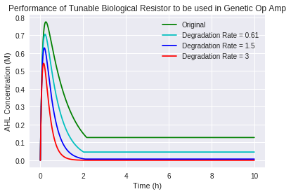

# Science-Fair
## 2018
A novel genetic circuit design was modelled to emulate resistor units to be used with biological op-amps. The resistor units were set up inside synells, which exploits quorum sensing to interact with the existing biological op-amp architecture via the negative feedback loop.

## 2021
- :tada: Update! This project is a candidate for 2021 Team Canada-ISEF :tada:! I've extended this project to better model the behaviour of the synthetic minimal cells with a system of delay differential equations and using more experimental data to refine the model!

The easiest way to run the code is on [Google Colab](https://colab.research.google.com/drive/1q7E10piQMLz7Oe-3c2QRlnTh4rOu2PYo?usp=sharing). Feel free to comment or suggest edits!

If you want to run the code on your local machine, I built this with Python 3.7, Numpy, Scipy and Matplotlib. I recommend that you use jupyter notebook for the [notebook](/2018/Biological_Computing_with_Synthetic_Minimal_Cells_and_Quorum_Sensing,_Sci_fair_2021.ipynb), but you could just run the [file](/2018/Analog_Computing.py) if you wanted.

Check out the wiki for an in-depth explanation of the project!

Thanks for looking at my project! I :sparkling_heart: U!
